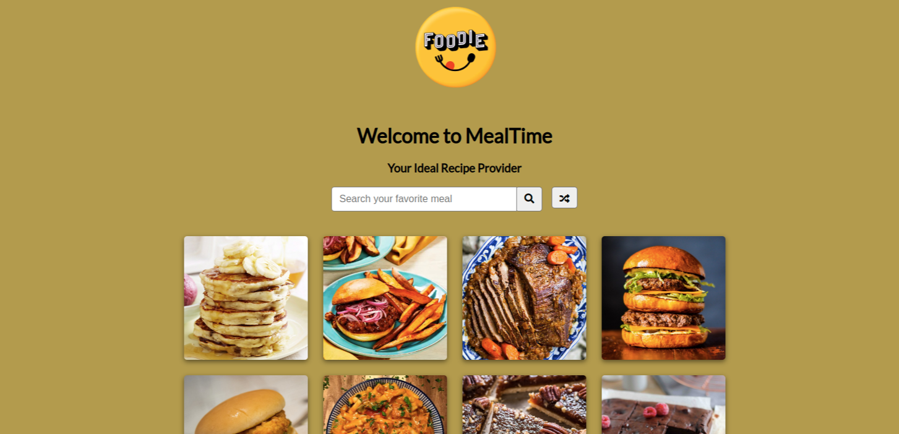

# Welcome to MealTime
This is a recipe-fetching website, 02/09/2022

By Kevin Kipkoech

## **Table of Contents**
[Description](#description)

[Installation Requirements](#installationrequirements)

[Installation Process](#installationprocess)

[Technology Used](#technologyused)

[References](#references)

[License](#license)

[Author Contact Info](#authorcontactinfo)
## **Description**
This website allows one to search their favorite recipes using a single keyword such as rice, pasta, chicken, and others. The data is fetched from TheMealDB API. 
## **Installation Requirements**
To install and run this project, you need:

-a laptop with a pre-installed operating system.

-Internet connection

-node installed on computer
## **Installation Process**
1. Clone the project onto your computer using the git clone command. Remember to use my repository address as the source. 
2. After ensuring you have all the html, js, and css files, navigate to the root folder and find the files. 
3. Copy the path of the index.html file. Paste and load it on the browser to view my sample webpage. 
4. Alternatively, you can see the website through this gh-pages link: https://kevinkipkoechmutai.github.io/MealTime/ 
5. The website may fail to display contents earlier on depending on internet space and ability to access online resources such as the font-awesome library and the API. If that happens, please give it a few minutes. 
## **Technology Used**
-HTML: Used to construct the page's structure and add content.

-CSS: Used to style the page and make it as appealing as possible. 

-JS: Used to make the website interactive and functional.

-Markdown: Used to write this readme file.
## **Reference**

## **License**
MIT License Copyright (c) 2022 Kevin Kipkoech
## **Author Contact Info**
Twitter: [Kevin Kipkoech](twitter.com/KevinKipkoechM1?s=09)

Email: [Kevin Kipkoech](kevin.kipkoech@student.moringaschool.com)

LinkedIn: [Kevin Kipkoech](https://www.linkedin.com/in/kevin-kipkoech-651a15108)

 ## **Page Screenshot**

 
